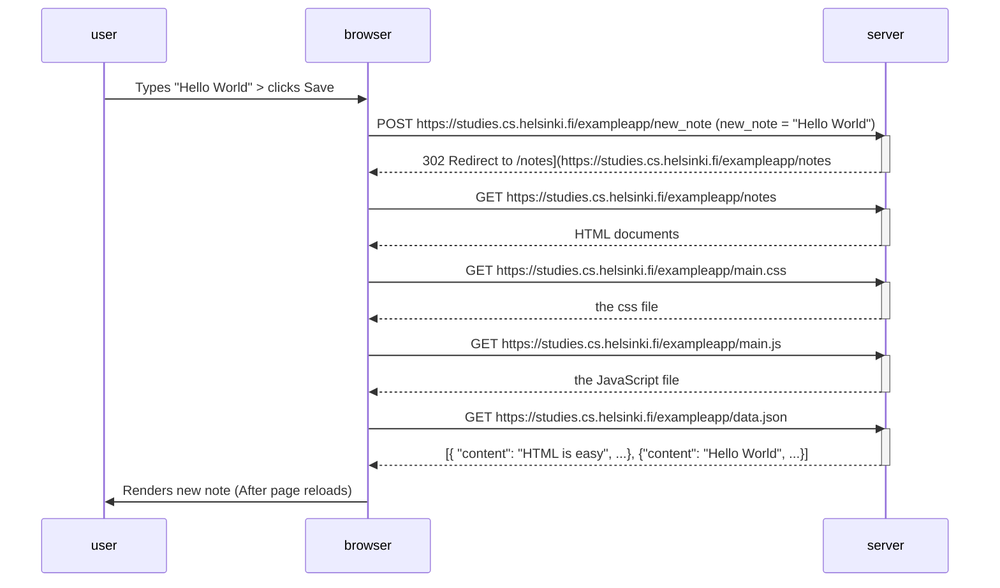

```mermaid
sequenceDiagram
    participant user
    participant browser
    participant server

    user->>browser: Types "Hello World" > clicks Save
    browser->>server: POST https://studies.cs.helsinki.fi/exampleapp/new_note (new_note = "Hello World")
    activate server
    server-->>browser: 302 Redirect to /notes](https://studies.cs.helsinki.fi/exampleapp/notes
    deactivate server

    %% Page reloads
    browser->>server: GET https://studies.cs.helsinki.fi/exampleapp/notes
    activate server
    server-->>browser: HTML documents
    deactivate server

    browser->>server: GET https://studies.cs.helsinki.fi/exampleapp/main.css
    activate server
    server-->>browser: the css file
    deactivate server

    browser->>server: GET https://studies.cs.helsinki.fi/exampleapp/main.js
    activate server
    server-->>browser: the JavaScript file
    deactivate server

    %% Javascript fetches updated data
    
    browser->>server: GET https://studies.cs.helsinki.fi/exampleapp/data.json
    activate server
    server-->>browser: [{ "content": "HTML is easy", ...}, {"content": "Hello World", ...}]
    deactivate server

    browser->>user: Renders new note (After page reloads)
    
    %% Browser renders updated notes
    %% Note right of browser: The browser executes the callback function that renders new note ("Hello World")
```
