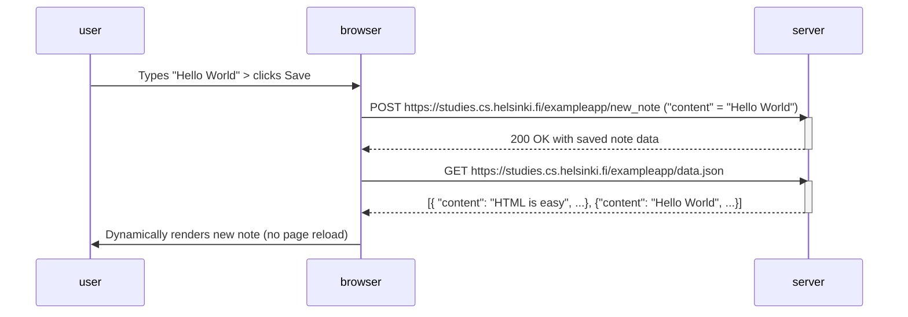

```mermaid
sequenceDiagram
    participant user
    participant browser
    participant server

    user->>browser: Types "Hello World" > clicks Save
    browser->>server: POST https://studies.cs.helsinki.fi/exampleapp/new_note ("content" = "Hello World")
    activate server
    %% No redirect after POST
    server-->>browser: 200 OK with saved note data
    deactivate server
    
    browser->>server: GET https://studies.cs.helsinki.fi/exampleapp/data.json
    activate server
    server-->>browser: [{ "content": "HTML is easy", ...}, {"content": "Hello World", ...}]
    deactivate server
    browser->>user: Dynamically renders new note (no page reload)
```
