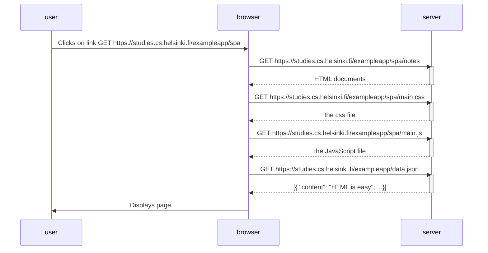

```mermaid
sequenceDiagram
    participant user
    participant browser
    participant server

    %% User clicks on the link
    user->>browser: Clicks on link GET https://studies.cs.helsinki.fi/exampleapp/spa

    %% Browser renders page
    browser->>server: GET https://studies.cs.helsinki.fi/exampleapp/spa/notes
    activate server
    server-->>browser: HTML documents
    deactivate server

    browser->>server: GET https://studies.cs.helsinki.fi/exampleapp/spa/main.css
    activate server
    server-->>browser: the css file
    deactivate server

    browser->>server: GET https://studies.cs.helsinki.fi/exampleapp/spa/main.js
    activate server
    server-->>browser: the JavaScript file
    deactivate server

    browser->>server: GET https://studies.cs.helsinki.fi/exampleapp/data.json
    activate server
    server-->>browser: [{ "content": "HTML is easy", ...}]
    deactivate server

    browser->>user: Displays page
```
