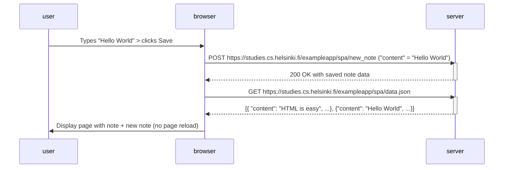

```mermaid
sequenceDiagram
    participant user
    participant browser
    participant server

    %% User enters new note "Hello World"
    user->>browser: Types "Hello World" > clicks Save
    browser->>server: POST https://studies.cs.helsinki.fi/exampleapp/spa/new_note ("content" = "Hello World")
    activate server
    %% No redirect after POST
    server-->>browser: 200 OK with saved note data
    deactivate server
    
    browser->>server: GET https://studies.cs.helsinki.fi/exampleapp/spa/data.json
    activate server
    server-->>browser: [{ "content": "HTML is easy", ...}, {"content": "Hello World", ...}]
    deactivate server
    browser->>user: Display page with note + new note (no page reload)
```
